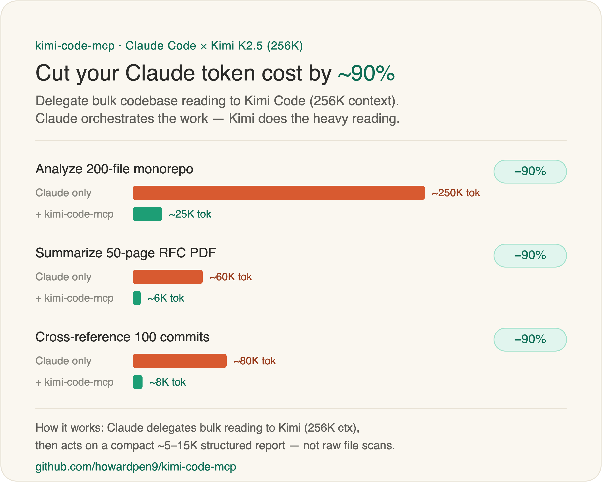
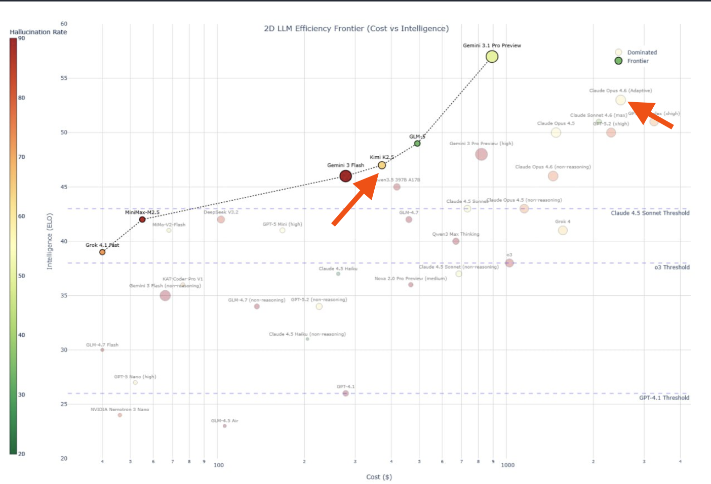

# kimi-code-mcp

**[English](README.md)** | 中文

---

<div align="center">
  
  <br />
  <sub>示意估算。這個 ~90% 是 <b>Claude 端</b> 在分析密集任務上的 token 減少 —— <b>不是</b>總成本歸零:Kimi 自己的<a href="https://www.kimi.com/code/en">訂閱費</a>照算。monorepo 那列對應下方實際舉例,PDF/commits 兩列為粗略示意。</sub>
</div>

---

MCP 伺服器，將 [Kimi Code](https://www.kimi.com/code)（模型 `kimi-for-coding`，256K 上下文，自動升級）與 [Claude Code](https://docs.anthropic.com/en/docs/claude-code) 串接——Claude 當指揮家，Kimi 負責大量閱讀。

<div align="center">
  
  <br />
  <sub>Kimi Code 位於效率前沿——接近 Claude 的智能水準，成本僅 1/10。 <a href="https://www.kimi.com/code">kimi.com/code</a></sub>
</div>

> [!TIP]
> **別再花 Claude 的錢讀檔了。** Kimi Code 以極低成本提供前沿級程式碼智能（見上圖）。把批量程式碼掃描交給 Kimi（256K 上下文，幾乎零成本），讓 Claude 專注它最擅長的——推理、決策、精準改碼。一次 `kimi_analyze` 呼叫可以取代 50+ 次檔案讀取，**分析密集型任務省下 60-80% 的 Claude token 成本。**

## 什麼是 Kimi Code？

[**Kimi Code**](https://www.kimi.com/code/en) 是 Moonshot AI 推出的 AI 程式碼代理。模型 ID `kimi-for-coding`（1T MoE，256K 上下文）由後端自動升級，無需鎖版本。支援終端機、IDE、CLI 多平台——自主撰寫、除錯、重構、分析程式碼。

核心規格：
- **256K token 上下文** — 一次讀完整個 codebase
- **平行 Agent 派生** — 同時處理多個任務
- **Shell、檔案、網路存取** — 完整開發工具鏈
- **安裝**：`curl -L code.kimi.com/install.sh | bash`

> [!WARNING]
> **需要 Kimi Code 會員。** 所有工具最終都會打到 Kimi Code，需要有效的 [Kimi Code 訂閱方案](https://www.kimi.com/code/en)。API 工具（`kimi_query`、`kimi_verify`)用 **API key** 認證;讀取程式碼的工具（`kimi_analyze`、`kimi_resume`)額外需要 **安裝 CLI + `kimi login`**。最新方案、額度與並發上限請見 [kimi.com/code](https://www.kimi.com/code/en)。

## 快速開始

```bash
# 1. 安裝 Kimi CLI 並登入
curl -L code.kimi.com/install.sh | bash
kimi login

# 2. 透過 npm 安裝
npm install -g kimi-mcp-server
```

在 `.mcp.json`（專案目錄或 `~/.claude/mcp.json` 全域）加入：

```json
{
  "mcpServers": {
    "kimi-code": {
      "command": "npx",
      "args": ["-y", "kimi-mcp-server"]
    }
  }
}
```

或從原始碼構建：

```bash
git clone https://github.com/howardpen9/kimi-code-mcp.git
cd kimi-code-mcp && npm install && npm run build
```

```json
{
  "mcpServers": {
    "kimi-code": {
      "command": "node",
      "args": ["/你的路徑/kimi-code-mcp/dist/index.js"]
    }
  }
}
```

在 Claude Code 中執行 `/mcp` 驗證，應該看到 `kimi-code` 和 8 個工具。

> [!TIP]
> **常見用途其實不需要 CLI。** `kimi_query` 和 `kimi_verify` 直接呼叫 Kimi Code API，不需要安裝 Python CLI、也不需要 `kimi login`。只要透過 `$KIMICODE_API_KEY` 或 `~/.kimi/config.toml` 提供 API key（見 [Kimi Code API 設定](#kimi-code-api-設定)）。只有讀取程式碼的工具（`kimi_analyze`、`kimi_resume`)才需要 CLI。完整對照見 [兩種後端：API vs CLI](#兩種後端api-vs-cli)。

## 兩種後端：API vs CLI

伺服器有兩種方式連到 Kimi，**每個工具會用最適合它的那一種**。知道哪個工具用哪種,就知道你需要設定什麼。

| 後端 | 怎麼連 Kimi | 需要什麼 | 看得到你的 codebase 嗎? |
|------|------------|---------|------------------------|
| **直連 API** | HTTPS 打 `api.kimi.com/coding/v1` | 只要一把 API key（`$KIMICODE_API_KEY` 或 `~/.kimi/config.toml`) | ❌ 不行 — 由你把 context 貼進去 |
| **本機 CLI** | 以子行程啟動 `kimi` 執行檔 | CLI 已安裝 **且** 完成 `kimi login` | ✅ 可以 — 直接從磁碟讀檔 |

| 工具 | 後端 | 原因 |
|------|------|------|
| `kimi_query` | **API**(沒設 key 時才退回 CLI) | 無上下文問答 — 不需 codebase,API 最簡單且無 login 依賴 |
| `kimi_verify` | **API** | 你把程式碼/diff/論點直接貼進去,Kimi 以獨立第三方身分判斷 |
| `kimi_analyze` | **CLI** | 必須從磁碟讀整個 codebase(256K 上下文) |
| `kimi_resume` | **CLI** | 接續一個保有先前 codebase 上下文的 CLI session |
| `kimi_list_sessions`、`kimi_cache_*`、`kimi_status` | 本機 | 讀本機 session/快取的元資料 |

> [!IMPORTANT]
> **多數使用者只需要 API key。** 如果你只是要第二意見/驗證(`kimi_query`、`kimi_verify`),設好 API key 就完成了 — 完全不用碰 CLI。只有當你想讓 Kimi 透過 `kimi_analyze` / `kimi_resume` 讀你的 codebase 時,才需要安裝 + `kimi login`。

隨時執行 **`kimi_status`** 就能看到哪些後端是活的 — 它會分別回報 API 設定狀態與 CLI 安裝/認證狀態。

## 給 Agent 的使用準則

如果你是 AI agent(Claude Code、subagent 等),決定何時呼叫這些工具:

- **提交前交叉檢查自己的工作 → `kimi_verify`。** 貼上實際的 diff/程式碼/論點,**外加周邊 context**(目標、限制、函式簽名)。Kimi 只看得到 `context` 字串 — 沒有 repo、沒有 session 歷史。Context 含糊 → 審查無用。
- **快速、與模型無關的程式問題 → `kimi_query`。** 不需 codebase,回傳另一個模型的觀點。
- **需要理解大型/陌生的 codebase → `kimi_analyze`**(帶 `work_dir`)。優先用這個,別自己讀 50 個檔案;它省下約 10× 的 Claude token。需要 CLI 已安裝並登入。
- **analyze 後想深入 → `kimi_resume`**(帶回傳的 `session_id`,保留最多 256K token 的先前上下文)。
- **不知道 Kimi 為何失敗 → 先 `kimi_status`。** CLI 顯示「未認證」**不影響** `kimi_query`/`kimi_verify`(那兩個走 API)。
- **輸出保持精簡。** 了解狀況預設用 `detail_level: summary`;需要程式碼片段才提高到 `normal`/`detailed`。輸出越大,Claude token 越多,就失去意義了。
- **小型/單檔工作別用 Kimi** — 10 個檔案以下,Claude 直接讀更快。

## Kimi Code API 設定

> [!NOTE]
> **Kimi Code API 和 Moonshot API 是獨立的供應商**——API Key 不互通。

有兩種方式設定 Kimi Code API：

### 方式一：OAuth 登入（推薦）

在 Kimi Code CLI Shell 模式下：

```bash
kimi
```

然後輸入 `/login`（或 `/setup`）：

```
/login
```

1. 選擇 **Kimi Code** 平台
2. 瀏覽器自動開啟進行 OAuth 授權
3. 配置自動儲存至 `~/.kimi/config.toml`

> [!NOTE]
> **安裝後出現 `zsh: command not found: kimi`?** 安裝程式把執行檔放在 `~/.local/bin/kimi`,它可能不在你的 `PATH` 裡。加進去(然後重啟 shell 或開新分頁):
> ```bash
> echo 'export PATH="$HOME/.local/bin:$PATH"' >> ~/.zshrc && source ~/.zshrc
> ```
> MCP 伺服器是用絕對路徑呼叫執行檔,所以這只影響你自己在終端機跑 `kimi`(例如 `kimi login`)。

### 方式二：手動設定 API Key

#### 取得 API Key

1. 前往 [code.kimi.com](https://code.kimi.com)
2. 登入 → **設定** → **API Keys**
3. 建立新的 Key（`sk-` 開頭，僅顯示一次）

#### 編輯設定檔

```bash
nano ~/.kimi/config.toml
```

加入：

```toml
[providers.kimi-code]
type = "kimi"
base_url = "https://api.kimi.com/coding/v1"
api_key = "sk-你的API密鑰"

[models.kimi-for-coding]
provider = "kimi-code"
model = "kimi-for-coding"
max_context_size = 262144
capabilities = ["thinking"]

[defaults]
model = "kimi-for-coding"
```

#### 使用環境變數（更安全）

```bash
# 加入 ~/.zshrc (macOS) 或 ~/.bashrc (Linux)
export KIMICODE_API_KEY="sk-你的API密鑰"
```

然後在 `config.toml` 中引用：

```toml
[providers.kimi-code]
type = "kimi"
base_url = "https://api.kimi.com/coding/v1"
api_key = "${KIMICODE_API_KEY}"
```

### 多供應商配置範例

可以同時設定 Kimi Code 和 Moonshot：

```toml
[providers.kimi-code]
type = "kimi"
base_url = "https://api.kimi.com/coding/v1"
api_key = "${KIMICODE_API_KEY}"

[providers.moonshot-cn]
type = "kimi"
base_url = "https://api.moonshot.cn/v1"
api_key = "${MOONSHOT_API_KEY}"

[models.kimi-for-coding]
provider = "kimi-code"
model = "kimi-for-coding"
max_context_size = 262144
capabilities = ["thinking"]

[models.kimi-k2]
provider = "moonshot-cn"
model = "kimi-k2-0905-preview"
max_context_size = 256000
capabilities = ["thinking"]

[defaults]
model = "kimi-for-coding"
```

隨時用 `/model` 或 `/model kimi-k2` 切換模型。

### Kimi Code vs Moonshot

| 特性 | Kimi Code | Moonshot |
|------|-----------|----------|
| 定位 | 專為編程優化 | 通用對話 |
| Endpoint | `api.kimi.com/coding/v1` | `api.moonshot.cn/v1` |
| API Key | 獨立申請 — [code.kimi.com](https://code.kimi.com) | 獨立申請 |
| SearchWeb / FetchURL | 原生支援 | 不支援 |
| 上下文 | 262K | 256K |

## 你可以做什麼

直接告訴 Claude 你需要什麼，它會自動委派給 Kimi：

| 你的 Prompt | 實際發生什麼 |
|------------|------------|
| 「分析這個 codebase 的架構」 | Kimi 讀取全部檔案（256K），Claude 根據報告行動 |
| 「掃描安全漏洞，然後審閱 Kimi 的發現」 | Kimi 審計，Claude 交叉審查——AI 結對審查 |
| 「映射 auth 模組的所有依賴，然後規劃重構」 | Kimi 建構依賴圖，Claude 規劃修改 |
| 「審閱最近的改動，檢查回歸和邊界情況」 | Kimi 審閱完整上下文（不只是 diff），Claude 整合 |
| 「恢復上次的 Kimi session，繼續問 API 設計」 | Kimi 跨 session 保留 256K token 上下文 |

## 為什麼需要這個？

Claude Code 很強大，但每次讀檔都消耗 token。很多工作——預審大型程式碼庫、跨檔案掃描、生成審計報告——屬於**確定性高的尾部任務**，不需要 Claude 的完整推理能力。

> [!IMPORTANT]
> **成本算術：** Claude 讀 50 個檔案理解架構 = 昂貴。Kimi 透過 `kimi_analyze` 讀 50 個檔案 = 幾乎免費。Claude 再根據 Kimi 的結構化報告行動 = 最少 token。**分析密集型任務總共省下 60-80% 的 Claude token。**

### 如何省 Token

```
                      ┌─────────────────────────────┐
                      │   你（開發者）                │
                      └──────────┬──────────────────┘
                                 │ prompt
                                 ▼
                      ┌─────────────────────────────┐
                      │   Claude Code（指揮家）       │
                      │   - 編排工作流                │
                      │   - 做決策                    │
                      │   - 精準編輯程式碼             │
                      └──────┬──────────────┬───────┘
                  精準        │              │  委派
                  編輯        │              │  批量閱讀
                  (token)    │              │  (免費)
                             ▼              ▼
                      ┌──────────┐   ┌──────────────┐
                      │ 你的     │   │  Kimi Code   │
                      │ 程式碼庫 │   │  - 256K 上下文│
                      └──────────┘   │  - 通讀全部   │
                                     │  - 回傳報告   │
                                     └──────────────┘
```

1. **Claude** 收到你的任務 → 判斷需要理解 codebase
2. **Claude** 透過 MCP 呼叫 `kimi_analyze` → Kimi 讀取整個程式碼庫（256K 上下文，近零成本）
3. **Kimi** 回傳結構化分析
4. **Claude** 根據分析做精準的程式碼修改

**結果：Claude 只花 token 在決策和寫碼，不浪費在讀檔上。**

### 基於 Kimi Code 的雙向程式碼審計

`kimi-for-coding` 為 1T MoE 模型，專為深度程式碼理解而設計。這讓 **AI 結對審查** 成為可能：

1. **Kimi 預審** — 256K 上下文一次看完整個 codebase：安全問題、反模式、死代碼、架構問題
2. **Claude 交叉審查** — 審閱 Kimi 的發現，質疑可疑項目，補充自己的洞察
3. **雙重視角** — 不同模型捕捉不同問題。一個遺漏的，另一個能發現

## 用 Kimi 做程式碼審查

除了即時分析，你可以將 Kimi 作為工作流中的**專職 Reviewer**：

### PR 審查流程

```
┌──────────────┐   diff    ┌──────────────┐  結構化發現  ┌──────────────┐
│   你的 PR    │ ────────► │  Kimi Code   │ ──────────► │  Claude Code │
│  (改動)      │           │  (審查者)    │             │  (決策)      │
└──────────────┘           └──────────────┘              └──────────────┘
```

### 持續審計模式

| 時機 | 做什麼 | 為什麼 |
|------|--------|--------|
| 合併前 | Kimi 掃描 diff + 受影響的模組 | 及早發現回歸 |
| 每週 | 全 codebase 掃描 | 累積的技術債 |
| 發版前 | 安全導向的全面審計 | 安心發版 |

每次審查 session 都可以**恢復**（`kimi_resume`）—— Kimi 跨 session 保留最多 256K token 的上下文，隨時間累積理解。

## 功能

| 工具 | 說明 | 超時 |
|------|------|------|
| `kimi_analyze` | **CLI** — 深度程式碼分析（架構、審計、重構建議） | 10 分鐘 |
| `kimi_query` | **API** — 快速問答，不需要 codebase 上下文（沒設 key 時才走 CLI） | 2 分鐘 |
| `kimi_verify` | **API** — 獨立第三方驗證程式碼／diff／論點；不需 CLI，需自帶完整 context | 5 分鐘 |
| `kimi_list_sessions` | 列出現有的 Kimi 分析 session | 即時 |
| `kimi_resume` | **CLI** — 恢復之前的 session（保留最多 256K token 上下文） | 10 分鐘 |
| `kimi_status` | 回報 API 設定狀態 + CLI 安裝/版本/認證狀態 | 即時 |
| `kimi_cache_status` | 檢視 session 快取統計與效能指標 | 即時 |
| `kimi_cache_invalidate` | 手動清除快取 session（指定目錄或全部） | 即時 |

### 輸出控制參數

`kimi_analyze` 和 `kimi_resume` 支援以下參數控制輸出大小：

| 參數 | 值 | 預設 | 效果 |
|------|---|------|------|
| `detail_level` | `summary` / `normal` / `detailed` | `normal` | 控制 Kimi 輸出的詳細程度 |
| `max_output_tokens` | 數字 | `15000` | 硬上限——超過時在乾淨的段落邊界截斷 |
| `include_thinking` | boolean | `false` | 包含 Kimi 的內部推理鏈（額外 10-30K tokens） |

`kimi_query` 也支援 `max_output_tokens` 和 `include_thinking`。

## Token 經濟學

> [!NOTE]
> 節省來自**壓縮比**，不是免費閱讀。Kimi 仍需訂閱費用，但關鍵價值是減少昂貴的 Claude Code token 消耗。

```
                    不用 kimi-code-mcp            用 kimi-code-mcp (normal)
                    ────────────────              ─────────────────────────
Raw source:         50 檔 × ~4K = 200K tokens    Kimi 讀取（訂閱費用）
Claude 讀取:        200K tokens                  5-15K token 報告
Claude token 成本:  $$$                          $
```

**`detail_level` 壓縮比：**

| 級別 | 壓縮比 | 輸出大小 | 等效原始碼量 | 適用場景 |
|------|--------|---------|-------------|---------|
| `summary` | 40-100x | ~2-5K tokens | ~8-20K 字符 / ~200-500 行代碼 | 快速了解、檔案清單 |
| `normal` | 15-40x | ~5-15K tokens | ~20-60K 字符 / ~500-1500 行代碼 | 架構審查、依賴分析 |
| `detailed` | 5-15x | ~15-40K tokens | ~60-160K 字符 / ~1500-4000 行代碼 | 含代碼片段的安全審計 |

**省 token 的場景：**
- 大型 codebase（50+ 檔案）— 架構理解、跨檔案掃描
- 安全審計、死代碼偵測、API 一致性檢查
- 重構前預審（先掃描 → 再改特定檔案）

**不如直接讓 Claude 讀的場景：**
- 小型 codebase（<10 檔案）— 直接讀更快
- 單檔案修改 — Claude 內建讀檔就夠
- 需要每行代碼 — `detailed` 輸出接近直讀成本

## 運作原理

```
┌──────────────┐  stdio/MCP   ┌──────────────┐  subprocess   ┌────────────────────┐
│  Claude Code │ ◄──────────► │ kimi-code-mcp│ ────────────► │ Kimi CLI           │
│  (指揮家)    │              │ (MCP 伺服器) │               │ (kimi-for-coding,  │
│              │              │              │               │  256K context)     │
└──────────────┘              └──────────────┘               └────────────────────┘
```

### CLI 呼叫參考

MCP 伺服器以非互動（print）模式呼叫 Kimi CLI：

```bash
kimi --work-dir <path> --print -p "<prompt>"
```

| Flag | 用途 |
|------|------|
| `--print` | 非互動模式——輸出結果後直接退出（subprocess 必須） |
| `-p` / `--prompt` | 直接傳入 prompt（跳過互動式 shell） |
| `--work-dir` / `-w` | 設定 codebase 根目錄 |
| `-S <id>` | 用 session ID 恢復之前的 session |
| `--no-thinking` | 關閉 thinking 模式 |

> [!NOTE]
> **`kimi analyze` subcommand 不存在。** MCP tool 命名為 `kimi_analyze`，但底層 CLI 使用上述 flags。如需直接呼叫 Kimi（除錯或腳本用途），請使用以上語法。

## 進階配置

開發模式（自動重編譯）：

```json
{
  "mcpServers": {
    "kimi-code": {
      "command": "npx",
      "args": ["tsx", "/你的路徑/kimi-code-mcp/src/index.ts"]
    }
  }
}
```

## 專案結構

```
src/
├── index.ts           # MCP 伺服器設定、工具定義、API/CLI 路由
├── kimi-api.ts        # 直連 Kimi Code API 的 client（kimi_query / kimi_verify）
├── kimi-runner.ts     # 生成 Kimi CLI 子行程、解析輸出、超時處理
├── cache-manager.ts   # session 快取（預熱、重用、失效）
└── session-reader.ts  # 讀取 Kimi session 元資料 (~/.kimi/)
```

## 貢獻

請參閱 [CONTRIBUTING.md](CONTRIBUTING.md)。

## 變更日誌

請參閱 [CHANGELOG.md](CHANGELOG.md)。

## 授權

MIT
